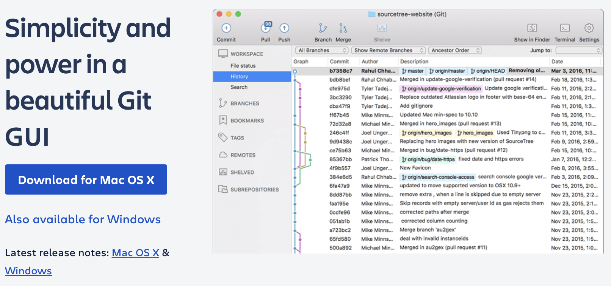
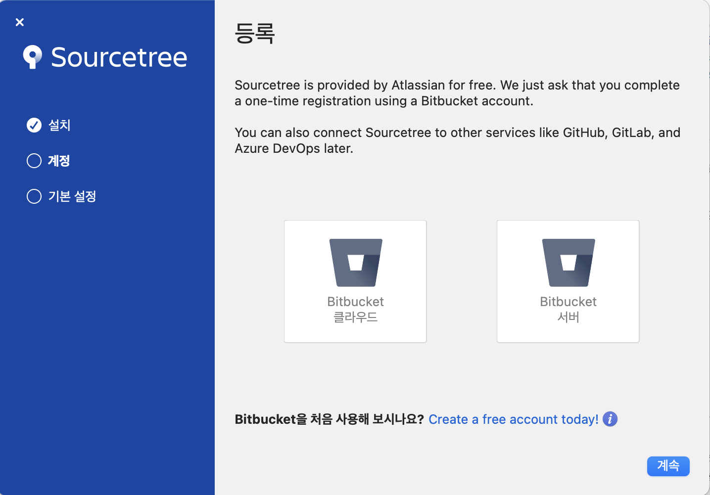
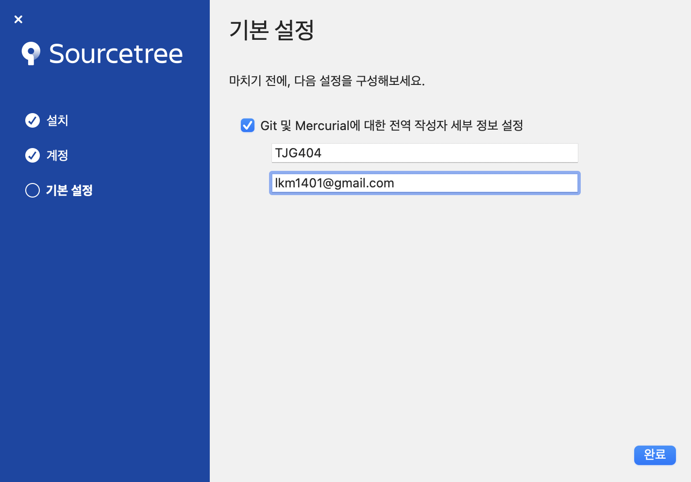
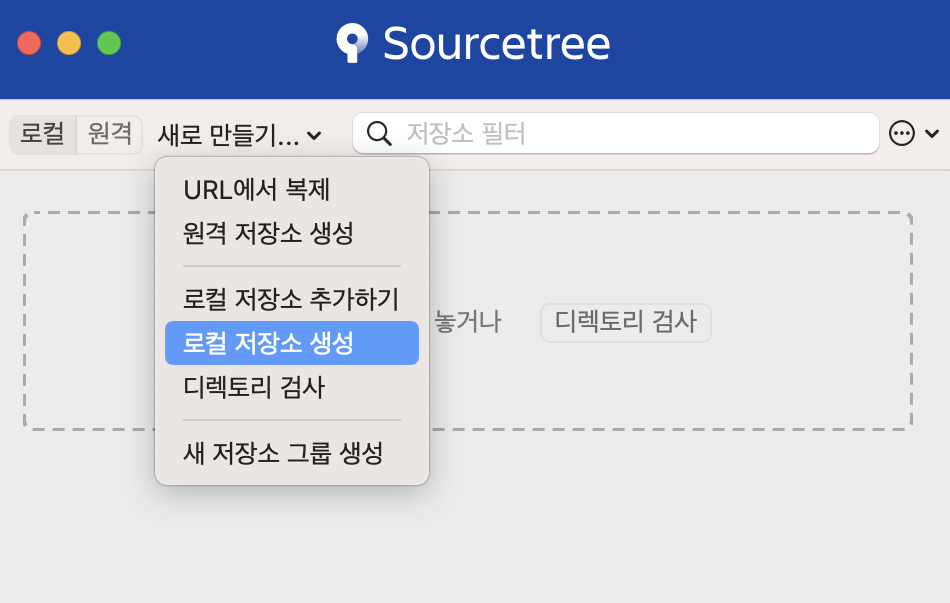
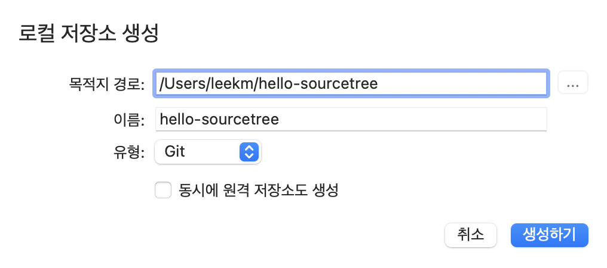
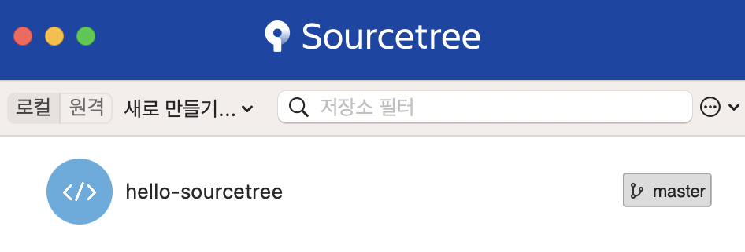
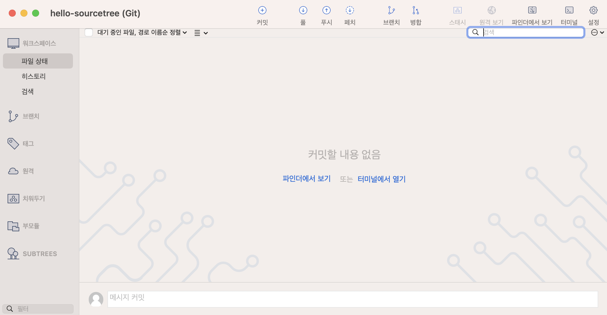
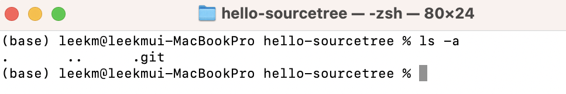

# Sourcetree(소스트리) 다운로드 및 설치

- https://www.sourcetreeapp.com/ 로 이동해서 다운받는다.

## 1. 소스트리 다운로드

Application 폴더로 이동한다.

## 2. 소스코드 설치하기

계속 버튼을 클릭한다.
  

git에서 설정한 사용자이름과 이메일을 입력한다.
  

로컬 저장소 생성을 선택한다.
  

로컬저장소 hello-sourcetree를 생성한다.
  

생성된 hello-sourcetree를 더블클릭한다.
  

로컬저장소가 잘 만들어졌는지 확인을 한다. 터미널에서 열기 메뉴를 선택한다.
  

.git 숨김폴더가 있다면 성공했다.

