# Git으로 버전관리 하기

## (1) 버전 관리 작업 진행

스테이지에 있는 버전이 될 후보를 버전으로 만들기 
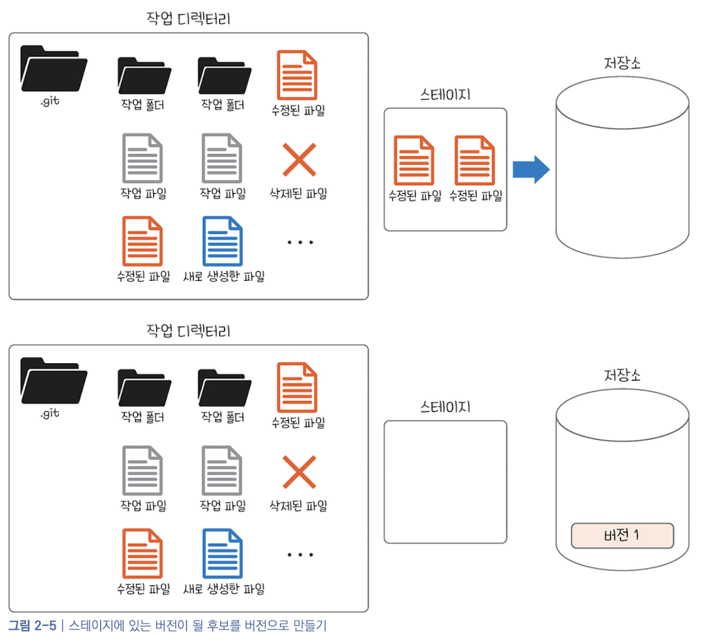
 

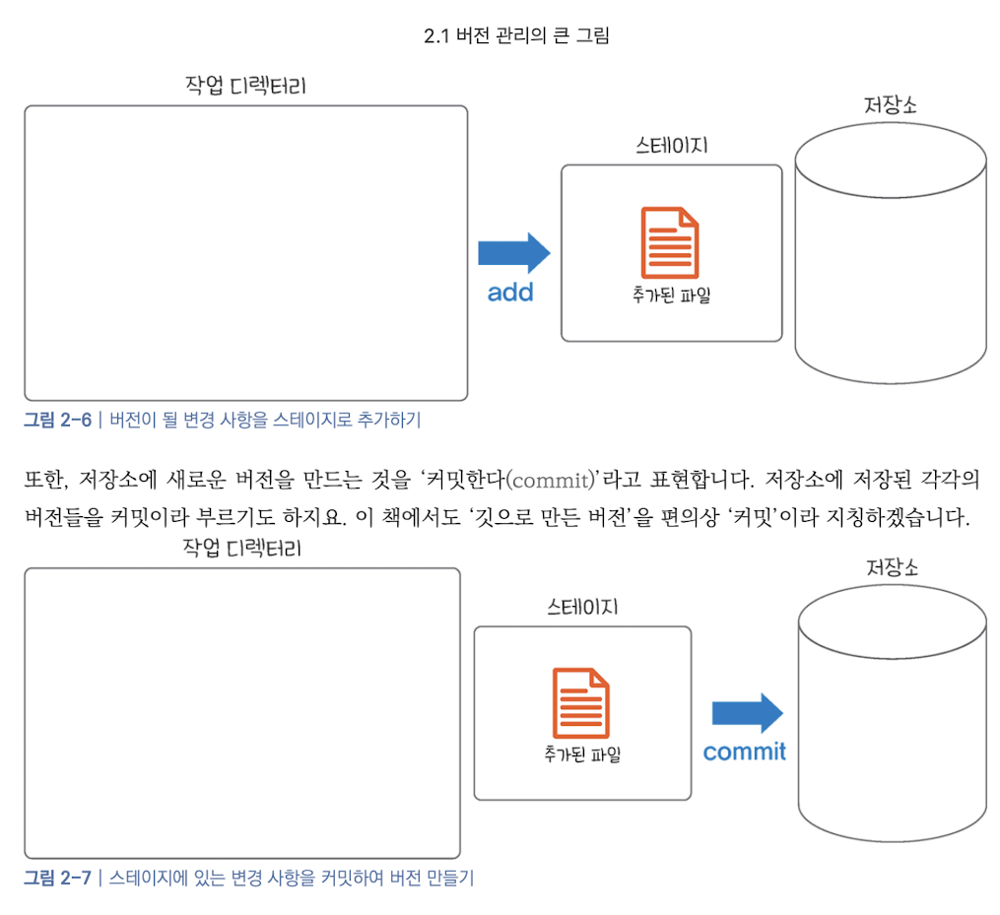
  
- 변경 사항 생성 -> 작업 디렉토리
- add -> 스테이지
- commit -> 저장소(로컬)
 

## (2) 버전 관리 맛보기

<1> 로컬 저장소 생성 

소스트리 실행 후 create 클릭 
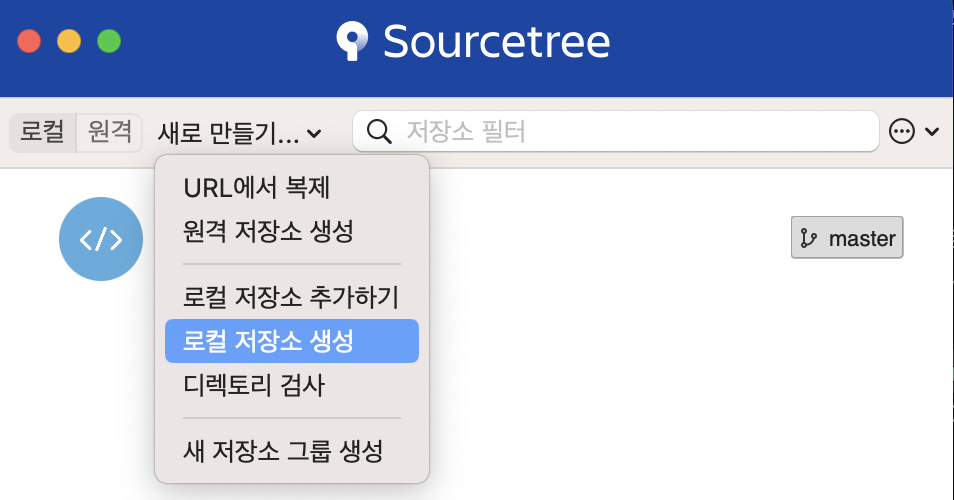
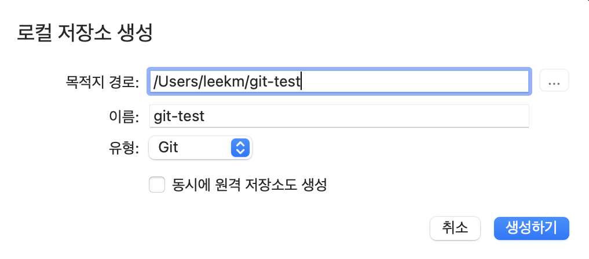
 

생성한 로컬저장소 git-test를 더블클릭한다. 
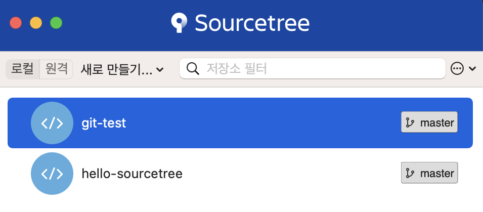
 

git-test 저장소에 테스트할 a.rtf(a.txt) 파일을 생성하면, 소스트리에 자동으로 추가된다.  
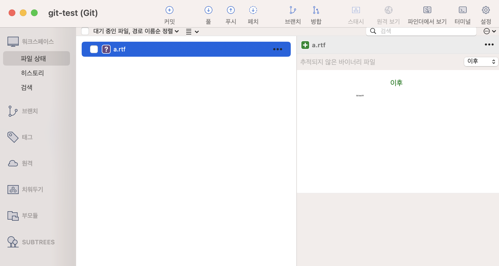
  

<2> 스테이지에 올리기 

파일옆의 점3개를 선택하여 스테이지 올리기 메뉴 선택 
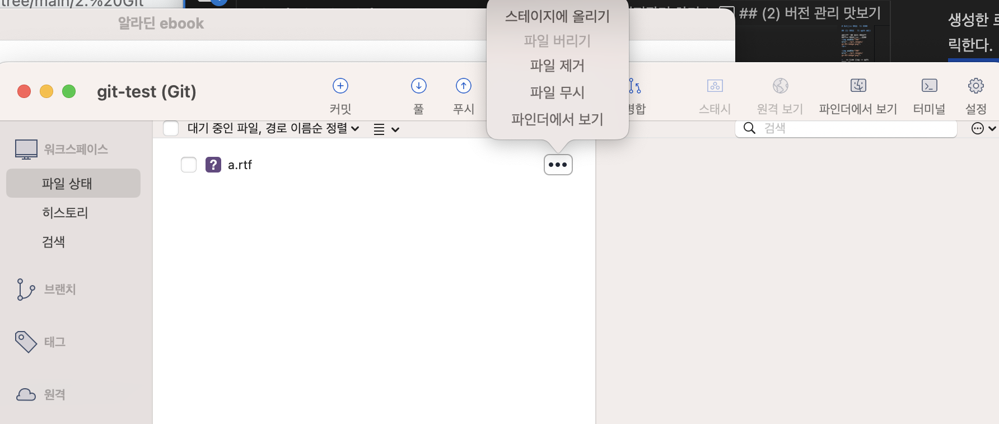

스테이지에 올라간 파일 확인 
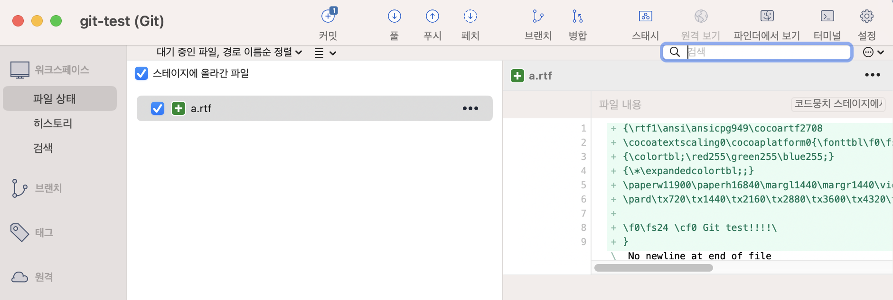

<3> commit 실행 및 결과 확인 

커밋 메시지를 작성 후 commit 버튼 클릭 
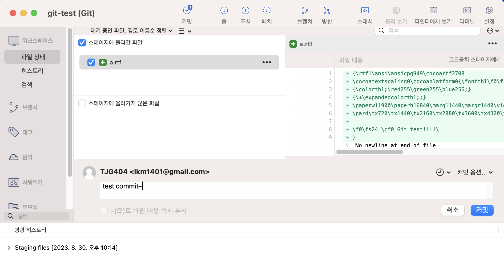

[히스토리] 메뉴 선택 
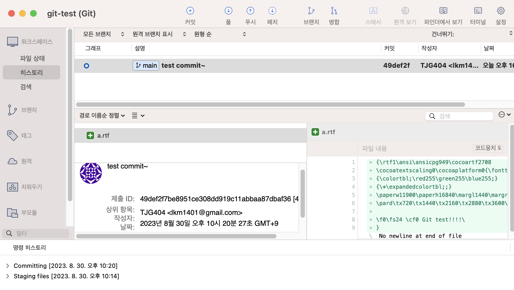

a.rtf 파일을 수정 후 commit을 하면 수정된 a.rtf 파일이 선택되어진다. 
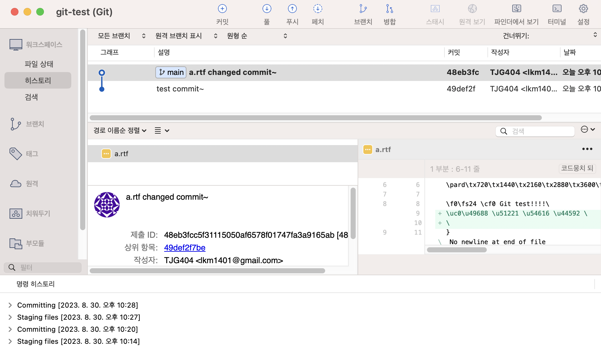
  

(3) .gitignore 파일 생성 

버전에 포함하지 않을 파일이나 폴더를 자동으로 무시하는 방법으로 .gitignore 파일을 생성한다. 
.gitignore 파일은 쉽게 말해 '무시할 파일/폴더 목록'을 적은 파일이다. 

- 작업디렉토리(/git-test)에 .gitignore 파일을 생성한다. except.rtf 파일 생성 후 .gitignore
파일안에 except.rtf 파일명을 입력한다. 
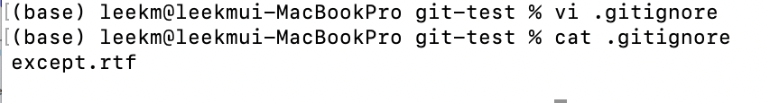
 

- 작업디렉토리(/git-test)에 except.rtf 파일이 존재하지만, 소스트리의 스테이지에 올라가지 않은 파일 항목에 except.rtf 파일이 생성되지 않는 것을 확인할 수 있다. 즉, Git이 except.rtf 파일을 무시한 것이다. 
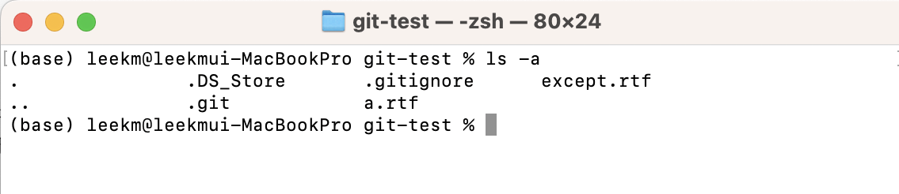
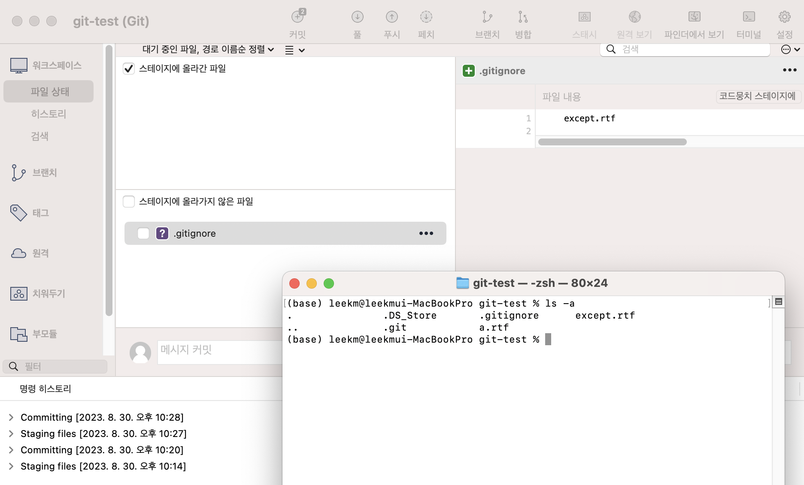
 

** .gitignore 파일 목록에 디렉토리를 무시할 경우에는 '폴더명/' 형식으로 추가해 주면 된다.

(4) commit 된 파일 비교하기 

- 추가정리!!
  

(5) 작업 되돌리기
- 스테이지에 올리기/내리기 
  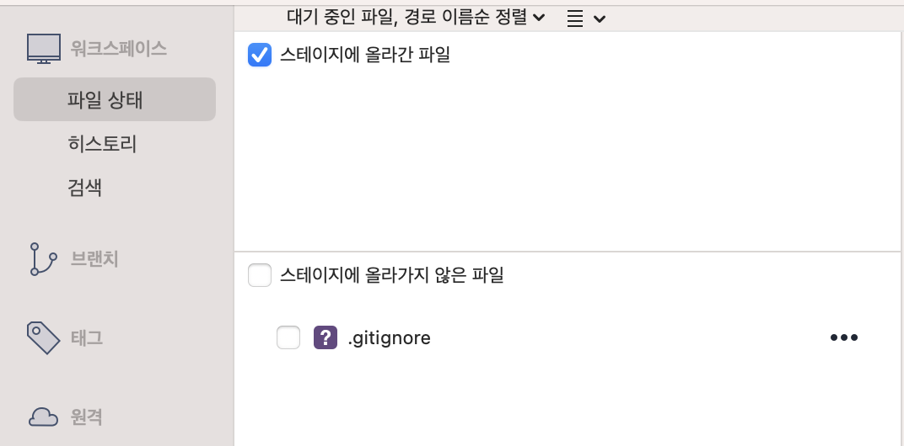
  체크박스 선택시 자동 올리기/내리기 이동 

- 커밋 되돌리기 revert/reverse (추가정리) 
