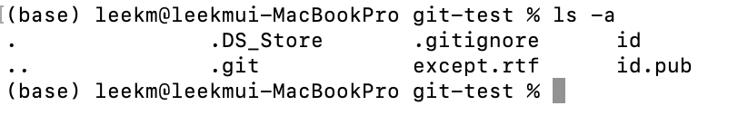

# GitHub(원격저장소) 연동

## 1. GitHub 소개

깃허브는 개발자의 SNS이다. 그리고, 백업을 할 수 있고 개발자 간 협업을 가능케 하는 원격 저장소 호스팅 서비스 이다.  


<br><br>

## 2. GitHub 사용자 프로필

[계정 선택] > [Your profile] > [Edit profile]<br>

<br><br>


## 3. 원격 저장소 호스팅 서비스, GitHub

```
깃허브가 제공하는 원격 저장소란 무엇일까요? 원격 저장소는 이름이 다소 거해 보일 수 있지만, 알고 보면 단순한 개념이다. 원격 저장소라는 이름 그대로 원격(remote)에 있는 저장소 이다. 앞선 장에서 여러분은 깃을 통해 저장소를 만들어 보았죠? 이 저장소는 여러분의 컴퓨터 속에만 존재하는 저장소이다. 이를 로컬(local)에 있는 저장소, 로컬 저장소라 부른다. 반면, 원격 저장소는 여러분의 컴퓨터 속에만 있는 저장소가 아닌, 인터넷 세상 어딘가에 있는 다른 컴퓨터 속의 저장소를 의미한다.

```


<br><br>


## 4. 소스트리와 깃허브 연동하기

소스트리와 깃허브가 SSH(Secure Shell) 통신을 할수 있도록 연동한다. SSH는 안전하게 정보를 주고 받을 수 있는 통신 방법이다. 소스트리와 깃허브가 서로 SSH 통신이 가능하도록 연동하면 로컬 저장소와 원격 저장소는 서로 안전하게 정보를 주고 받을 수 있다. <br>
SSH 통신하려면 먼저 여러분의 컴퓨터에서 키(key) 두 개를 생성해야 한다. 하나는 공개 키(public key), 또 다른 하나는 개인 키(private key) 이다. 개인 키는 자신만 알고 있어야 하는 키로 암호화된 문자열이라고 생각하면 된다. <br>


<br>

SSH 통신은 암호화된 통신 방법이므로 여러분과(공개 키를 전달받은) 깃허브 사이에 주고받는 대화는 암호화되어 전송된다. 다른 누군가가 여러분과 깃허브 사이에 주고받는 대화를 엿듣는다고 해도 전혀 이해할 수 없다. 하지만, 여러분은 개인키가 있어서 깃허브에 여러분임을 증명하고 깃허브와 주고받는 내용을 이해할 수 있다. SSH는 개발 전반에 많이 활용하는 통신 방법이므로 꼭 알아도록 하자!!<br>

#### 1) SSH 키 생성

```
ssh-keygen
```

<br>

#### 2) 생성된 SSH 키 확인

```
ls -a
```
id, id.pub 가 생성된 키이다.<br>

<br>

```
cat id.pub  #공개키 파일 확인하기
```
해당 공개키를 복사해서 GitHub에 등록해 SSH를 이용해 사용자 인증 가능

<br><br>

#### 3) GitHub에 키 등록

[프로필] > [Settings] 선택<br>

<br>

[SSH and GPG keys] > [SSH keys] > New SSH Key 선택<br>
<br>

[Add SSH key] 버튼 클릭 후 패스워드 입력하여 재 로그인<br>


#### 4) 소스트리에서 GitHub 연동

[창] > [저장소 브라우저 보기] > [계정] 메뉴 선택 <br>

<br>

계정 탭 [추가..] > 옵션 확인 후 [계정연결] 메뉴 선택 <br>


[Authorize atlassian] 버튼 클릭 후 로그인 화면에서 패스워드 입력 창에서 패스워드 입력 후 재로그인<br>

<br>소스트리 앱을 열도록 허용함<br>

<br>

[저장] 버튼이 활성화 됨<br>
SSH가 없으면 [키 생성하기] 버튼을 클릭하여 키를 생성한다.<br>
<br>
<br>

<br><br>

